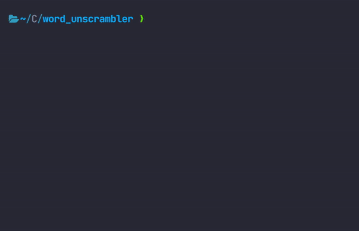

# word_unscrambler

This Rust program outputs a list of the possible options a scrambled word could be.

_Looking for the Python version? Its in the
[python-version](https://github.com/tinmarr/Word-Unscrambler/tree/python-version) branch_

_Looking for the Go version? Its in he
[go-version](https://github.com/tinmarr/Word-Unscrambler/tree/go-version) branch_



## About

This program was created by [Martin Chaperot-Merino](https://github.com/tinmarr)

This word unscrambler can clean unstructured text before employing a named entities recognition (NER) algorithm. For
example, the word unscrambler function can be applied to every word in a text file before looking these words up in a
gazetteer (a list of entities such as cities, organizations, days of the week, etc.)

# How to use

1. Clone the repo
2. Run `cargo run`
3. Enter a scrambled word
4. Hit enter

# How it works

It takes words from a text file and uses a lookup function to find words with the same letters (where the order of words
does not matter).

## The key to its speed

It converts all the words into integers (which is based on the letters) and groups words with the same integer in a
`BTreeMap`. This is a hash map that uses a binary search tree instead of a hashing algorithm (faster for integers). Then
it converts the typed word into an integer and looks up that integer in the map.

The function `word_2_int` (shown below) is what converts the word to an unsigned 128 bit integer. Every 4 bits
represents the number of occurrences of a specific letter. For example, the string "aaabc" would be represented by 0000
... 0001 0001 0011 or 275. The beauty of this system is that all words with those same letters will be represented by
that same number. This allows us to use that number as the key for our map.

```rust
const LETTERS: [char; 26] = [
    'a', 'b', 'c', 'd', 'e', 'f', 'g', 'h', 'i', 'j', 'k', 'l', 'm', 'n', 'o', 'p', 'q', 'r', 's',
    't', 'u', 'v', 'w', 'x', 'y', 'z',
];

fn word_2_int(word: &String) -> u128 {
    let mut word_int: u128 = 0;
    for letter in word.chars() {
        let i: u32 = match LETTERS.binary_search(&letter) {
            Ok(i) => i,
            Err(_) => continue,
        }
        .try_into()
        .expect("If this panics something went horribly wrong");
        word_int += 2u128.pow(4u32 * i);
    }
    word_int
}
```
