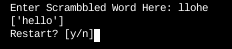

# Word-Unscrambler
This python program outputs a list of the possible options a scrambled word could be.


## About 
This program was created by [Martin Chaperot-Merino](https://github.com/tinmarr)

This word unscrambler can clean unstructured text before employing a named entities recognition (NER) algorithm. For example, the word unscrambler function can be applied to every word in a text file before looking these words up in a gazetteer (a list of entities such as cities, organizations, days of the week, etc.)

# How to use
1. Open the IDE: [https://replit.com/@Tinmarr/Word-Unscrambler?v=1](https://replit.com/@Tinmarr/Word-Unscrambler?v=1)
2. Wait for the Prompt <br />

3. Enter a scrambled word <br />

4. Hit enter <br />


# How it works
It takes words from a text file and uses a lookup function to find words with the same letters (where the order of words does not matter).

## The key to its speed
It converts all the words into integers (which is based on the letters) and groups words with the same integer in a dictionary. Then it converts the typed word into an integer and looks up that integer in the dictionary.

A first function Word2Vect converts a word into a 26 dimensions vector. Each dimension represents the number of occurrences of a letter ('a', 'b', 'c'...). 
```
def Word2Vect(word):
    l = ['a','b','c','d','e','f','g','h','i','j','k','l','m','n','o','p','q','r','s','t','u','v','w','x','y','z']
    v = [0, 0, 0, 0, 0, 0, 0, 0, 0, 0, 0, 0, 0, 0, 0, 0, 0, 0, 0, 0, 0, 0, 0, 0, 0, 0]
    w = word.lower()
    wl = list(w)
    for i in range(0, len(wl)):
        if wl[i] in l:
            ind = l.index(wl[i])
            v[ind] += 1
    return v
```
Then a second function Vect2Int converts a 26 dimensions vector into an integer. Each dimension is reduced to a 4 bits. All bits of the Integer are used to code the vector.
```
def Vect2Int(vect):
    pv = 0
    f = 0
    for i in range(0, len(vect)):
        wip = (vect[i]*(2**pv))
        f += wip
        pv += 4
    return f
```
Using an integer as lookup value in a dictionary makes it run really fast!
